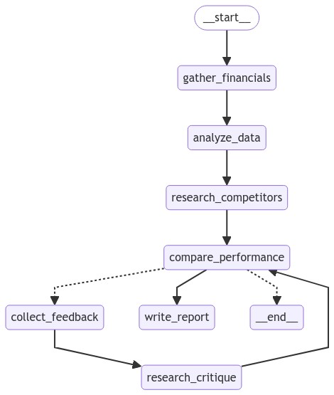

# Financial Report Generator

This project is a Financial Report Generator that uses AI-powered analysis to create comprehensive financial reports based on company data and competitor information.

## Features

- Analyzes financial data from CSV files
- Researches and compares competitor performance
- Generates detailed financial reports
- Uses AI to provide insights and critiques
- Implements a multi-step workflow for report generation
- Provides a Streamlit-based web interface for easy interaction

## Dependencies

- os
- pandas
- io
- dotenv
- langchain_openai
- langgraph
- tavily
- langchain_core
- pydantic
- streamlit

## Setup

### Using a Virtual Environment

It's recommended to use a virtual environment for this project. Here's how to set it up:

1. Create a virtual environment:
   ```
   python -m venv .venv
   ```

2. Activate the virtual environment:
   - On Windows:
     ```
     .venv\Scripts\activate
     ```
   - On macOS and Linux:
     ```
     source .venv/bin/activate
     ```

3. Your command prompt should now show the name of your virtual environment, indicating it's active.

4. Install the required dependencies in the virtual environment:
   ```
   pip install pandas python-dotenv langchain-openai langgraph tavily-python langchain-core pydantic streamlit
   ```

5. When you're done working on the project, you can deactivate the virtual environment:
   ```
   deactivate
   ```

### Environment Setup

1. Set up your environment variables:
   - Create a `.env` file in the project root
   - Add your API keys:
     ```
     OPENAI_API_KEY=your_openai_api_key
     TAVILY_API_KEY=your_tavily_api_key
     ```

## How It Works

The Financial Report Generator uses a graph-based workflow to process and analyze financial data:


1. **Gather Financials**: Extracts financial data from the provided CSV file.
2. **Analyze Data**: Performs initial analysis on the financial data.
3. **Research Competitors**: Gathers information about specified competitors.
4. **Compare Performance**: Compares the company's performance with competitors.
5. **Collect Feedback**: Generates feedback on the performance comparison.
6. **Research Critique**: Performs additional research based on the feedback.
7. **Write Report**: Generates the final financial report.

The workflow is implemented using `langgraph`, allowing for conditional processing and multiple revision cycles.

## Usage

Ensure your virtual environment is activated, then run the Streamlit app:

```
streamlit run finance_agent.py
```

In the web interface:
1. Enter the analysis task.
2. Specify competitors (comma-separated).
3. Set the maximum number of revision cycles.
4. Upload a CSV file containing the company's financial data.
5. Click "Generate Report" to start the analysis process.

The app will display the progress of each step and present the final report when completed.

## Customization

You can modify the system prompts for each step of the analysis by updating the corresponding prompt variables (e.g., `GATHER_FINANCIALS_PROMPT`, `ANALYZE_DATA_PROMPT`, etc.).

